<div align="center">
  <a href="README.md">Read in English</a> | 🌐 <strong>خواندن به زبان فارسی</strong>
</div>

<br/>

<div align="center" dir="rtl">
  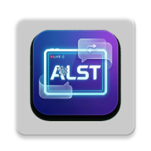

  <h1>📱 ALST — ترجمه زنده و هوشمند صفحه نمایش</h1>

  <p><strong>ترجمه بی‌درنگ و بصری متون صفحه اندروید با قدرت هوش مصنوعی چندوجهی Gemini 3.6 Flash و ML Kit گوگل.</strong></p>

  <p>
    <a href="https://github.com/navidseyedain/ALSTMobile/releases/latest"></a>
    <a href="https://github.com/navidseyedain/ALSTMobile/releases/download/v1.0.0/ALST-v1.0.0.apk"></a>
    <a href="https://github.com/navidseyedain/ALSTMobile/stargazers"></a>
    <a href="https://github.com/navidseyedain/ALSTMobile/network/members"></a>
    
    
    <a href="LICENSE"></a>
  </p>

  <p>
    <a href="https://github.com/navidseyedain/ALSTMobile/releases/download/v1.0.0/ALST-v1.0.0.apk">
      
    </a>
  </p>

  <p>
    <b>هر بازی، کمیک، چت یا برنامه خارجی را در لحظه روی صفحه ترجمه کنید.</b><br/>
    <i>بدون ردیابی داده (No Telemetry). بدون اشتراک. ۱۰۰٪ رایگان و متن‌باز.</i>
  </p>

  <br/>

  <!-- گیف دمو و عملکرد برنامه -->
  

</div>

---

<div dir="rtl">

## 📑 فهرست مطالب
- [🌍 معرفی پروژه ALST](#-معرفی-پروژه-alst)
- [✨ ویژگی‌های کلیدی](#-ویژگیهای-کلیدی)
- [📸 تصاویر محیط برنامه و نمونه‌های ترجمه](#-تصاویر-محیط-برنامه-و-نمونههای-ترجمه)
- [🔬 نحوه کارکرد و معماری سیستم](#-نحوه-کارکرد-و-معماری-سیستم)
- [📊 جدول مقایسه با سایر ابزارها](#-جدول-مقایسه-با-سایر-ابزارها)
- [🛠 تکنولوژی‌ها و وابستگی‌ها](#-تکنولوژیها-و-وابستگیها)
- [📂 ساختار پوشه‌بندی پروژه](#-ساختار-پوشهبندی-پروژه)
- [🔒 حریم خصوصی و امنیت](#-حریم-خصوصی-و-امنیت)
- [🚀 راه‌اندازی و نصب سریع](#-راهاندازی-و-نصب-سریع)
- [🗺 نقشه راه (Roadmap)](#-نقشه-راه-roadmap)
- [🤝 مشارکت در توسعه](#-مشارکت-در-توسعه)
- [📄 لایسنس](#-لایسنس)
- [👤 درباره توسعه‌دهنده](#-درباره-توسعهدهنده)

---

## 🌍 معرفی پروژه ALST

**ALST (AI Live Screen Translation)** یک ابزار قدرتمند و متن‌باز برای سیستم‌عامل اندروید است که موانع زبانی را در تمامی برنامه‌ها از بین می‌برد. این برنامه از طریق یک دکمه شناور غیرمزاحم در پس‌زمینه اجرا می‌شود؛ با استفاده از قابلیت سخت‌افزاری `MediaProjection` تصویر صفحه را ضبط کرده، با **مدل بینایی هوش مصنوعی Gemini 3.6 Flash** متون را تحلیل و ترجمه می‌کند و در نهایت با استفاده از `WindowManager` متن‌های ترجمه شده را دقیقاً در همان مختصات اصلی روی صفحه جایگذاری می‌نماید.

چه در حال تجربه یک بازی موبایل خارجی بدون زبان انگلیسی باشید، چه در حال خواندن مانهوا/مانگا، و چه در حال گفتگو در پیام‌رسان‌ها، ALST یک تجربه روان و در لحظه را بدون نیاز به اسکرین‌شات دستی یا جابجایی بین برنامه‌ها برای شما فراهم می‌کند.

> ### 💡 مهم‌ترین کاربردها:
> - 🎮 **بازی‌های ویدیویی**: اجرای بازی‌های ژاپنی و کره‌ای با ترجمه زنده دیالوگ‌ها و منوها.
> - 📖 **کمیک، مانگا و وب‌تون**: مطالعه روان بدون نیاز به انتظار برای ترجمه تیم‌های دیگر.
> - 💬 **چت و پیام‌رسان‌ها**: ترجمه آنی مکالمات در واتساپ، تلگرام و دیسکورد.
> - 📰 **مطالعه اخبار و مقالات خارجی**: خواندن مستقیم متون با پشتیبانی کامل از رندر راست‌چین (RTL).

---

## ✨ ویژگی‌های کلیدی

### ⚡ ترجمه تک‌مرحله‌ای با هوش مصنوعی (Single-Pass Multimodal)
- **حذف گلوگاه OCR سنتی**: تصویر مستقیماً توسط هوش مصنوعی چندوجهی تحلیل شده و نیازی به پردازش چندمرحله‌ای کند نیست.
- **درک عمیق متنی و معنایی**: درک اصطلاحات محاوره‌ای، اسلنگ‌ها، واژگان تخصصی بازی‌ها و جملات پیوسته.
- **تشخیص خودکار زبان‌های ترکیبی**: قابلیت تشخیص و ترجمه همزمان چندین زبان مختلف در یک صفحه (مثلاً فارسی + انگلیسی + ژاپنی).
- **مختصات فضایی فوق‌العاده دقیق**: محاسبه کادرهای متنی بر اساس مقیاس تراکم پیکسلی (Density) برای جلوگیری از بهم‌ریختگی لایه‌ها.

### 📴 ترجمه کاملاً آفلاین (Google ML Kit)
- پشتیبانی از OCR و ترجمه محلی و بدون نیاز به اینترنت برای زبان‌های لاتین مناسب برای زمان مسافرت یا عدم دسترسی به شبکه.
- پنل مدیریت دانلود پکیج‌های زبانی با امکان بررسی وضعیت آپدیت.

### 🎯 دکمه شناور (FAB) و لایه‌های هوشمند
- **دکمه شیشه‌ای قابل جابجایی**: امکان حرکت دادن آزادانه دکمه در لبه‌های صفحه نمایش.
- **بستن سریع با یک لمس**: لمس هر نقطه از صفحه لایه‌های ترجمه را پنهان می‌کند و تایم‌اوت خودکار ۳۰ ثانیه‌ای مانع مسدود شدن دید می‌شود.
- **دکمه اختصاصی خروج**: نگه داشتن دکمه شناور، دکمه قرمز بستن کامل سرویس پس‌زمینه را ظاهر می‌کند.
- **پشتیبانی از Quick Settings Tile**: روشن و خاموش کردن سرویس مستقیماً از نوار نوتیفیکیشن اندروید.

### 🔋 بهینه‌سازی شدید مصرف باتری و رم
- **محدودسازی نرخ فریم (۳۰۰ میلی‌ثانیه)**: جلوگیری از رندر بیهوده فریم‌ها و داغ شدن پردازنده.
- **بازیافت کامل حافظه**: آزادسازی فوری حافظه بافرهای تصویر و بافت‌های گرافیکی برای جلوگیری از خطای کمبود حافظه (OOM).
- **سازگاری کامل با اندروید ۱۴ و ۱۵**: رعایت کامل استانداردهای دسترسی `FOREGROUND_SERVICE_MEDIA_PROJECTION`.

---

## 📸 تصاویر محیط برنامه و نمونه‌های ترجمه

### 🎨 داشبورد مدرن شیشه‌ای (Glassmorphic Dashboard)
<div align="center">
  <table border="0">
    <tr>
      <td align="center" width="33%">
        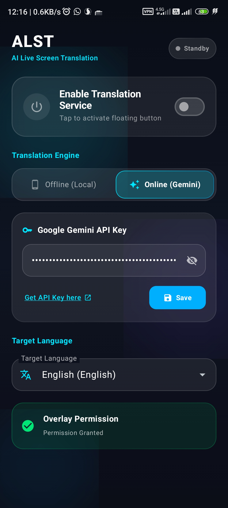<br/>
        <b>حالت آنلاین هوش مصنوعی (Gemini)</b>
      </td>
      <td align="center" width="33%">
        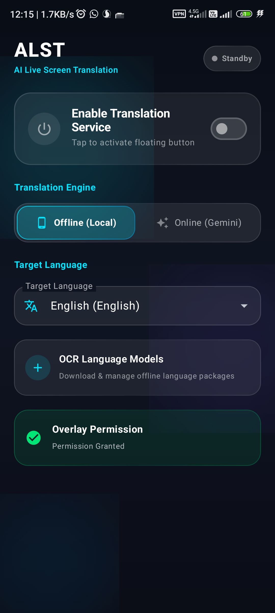<br/>
        <b>حالت آفلاین محلی (ML Kit)</b>
      </td>
      <td align="center" width="33%">
        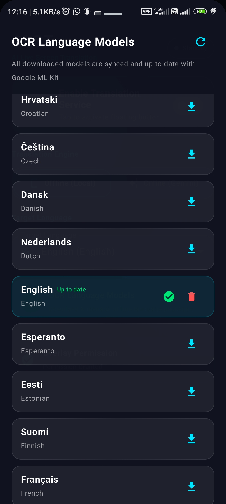<br/>
        <b>مدیریت و همگام‌سازی مدل‌های آفلاین</b>
      </td>
    </tr>
  </table>
</div>

<br/>

### 🌐 نمونه‌های ترجمه زنده روی صفحه به ۴ زبان زنده دنیا
ALST بدون به هم ریختن چیدمان، متن‌ها را با فونت تمیز در همان جای اصلی جایگزین می‌کند:

<div align="center">
  <table border="0">
    <tr>
      <td align="center" width="50%">
        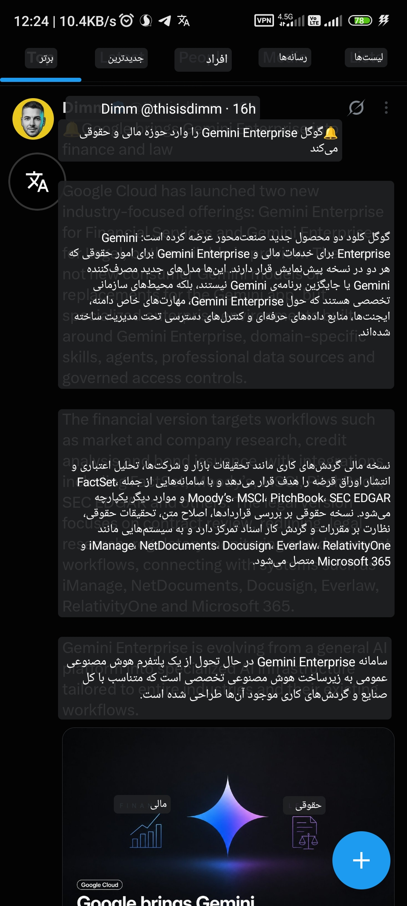<br/>
        <b>🇮🇷 ترجمه زنده به فارسی (Persian)</b>
      </td>
      <td align="center" width="50%">
        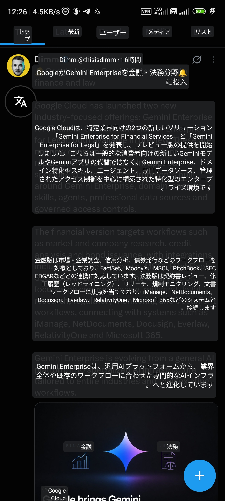<br/>
        <b>🇯🇵 ترجمه زنده به ژاپنی (Japanese)</b>
      </td>
    </tr>
    <tr>
      <td align="center" width="50%">
        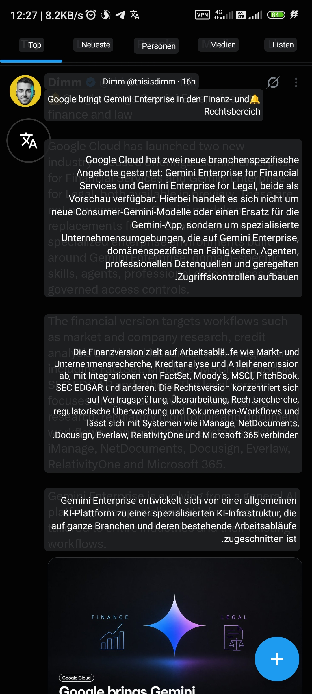<br/>
        <b>🇩🇪 ترجمه زنده به آلمانی (German)</b>
      </td>
      <td align="center" width="50%">
        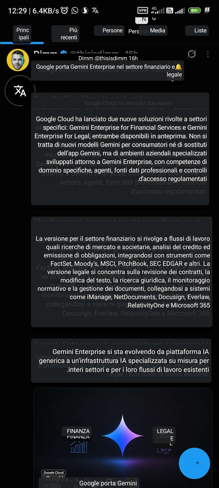<br/>
        <b>🇮🇹 ترجمه زنده به ایتالیایی (Italian)</b>
      </td>
    </tr>
  </table>
</div>

<br/>

### ⚡ دکمه شناور و کاشی تنظیمات سریع اندروید
<div align="center">
  <table border="0">
    <tr>
      <td align="center" width="33%">
        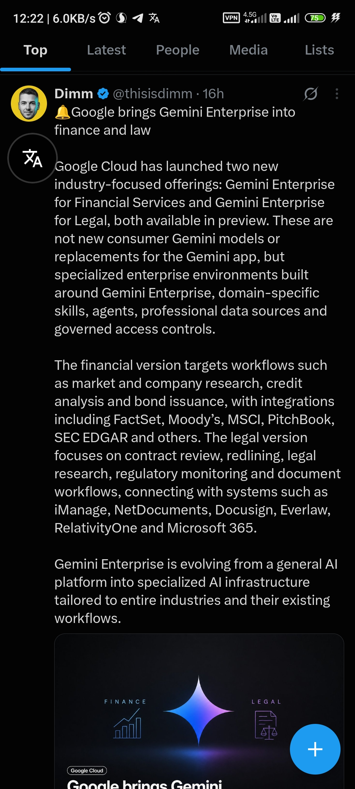<br/>
        <b>دکمه شناور غیرمزاحم روی صفحه</b>
      </td>
      <td align="center" width="33%">
        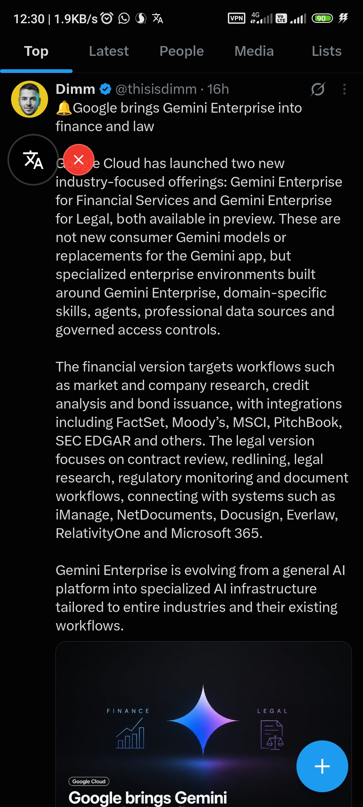<br/>
        <b>دکمه اختصاصی خروج از سرویس</b>
      </td>
      <td align="center" width="33%">
        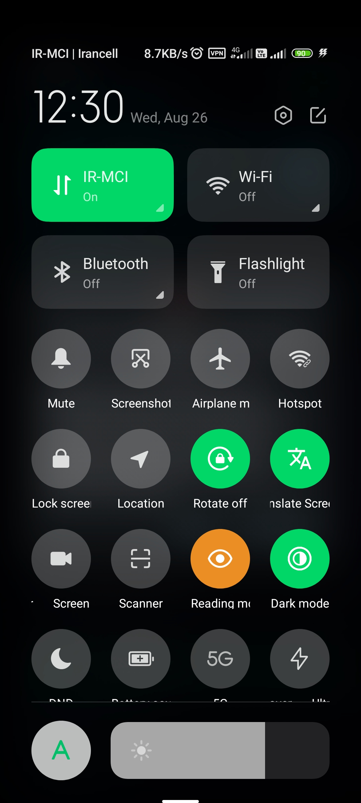<br/>
        <b>کاشی تنظیمات سریع (Quick Settings)</b>
      </td>
    </tr>
  </table>
</div>

---

## 🔬 نحوه کارکرد و معماری سیستم

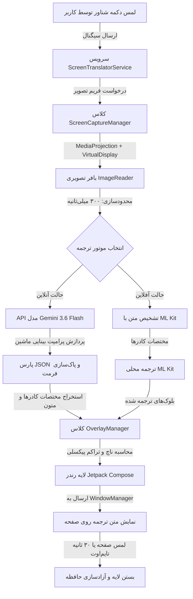

---

## 📊 جدول مقایسه با سایر ابزارها

| قابلیت | ALST (این پروژه) | Google Lens / اپ گوگل | مترجم‌های متداول صفحه |
| :--- | :---: | :---: | :---: |
| **موتور هوش مصنوعی** | **Gemini 3.6 Flash + ML Kit** | Google Translate | Tesseract OCR ساده |
| **درک محتوایی و معنایی** | 🟢 **بسیار بالا (سطح LLM)** | 🟡 متوسط | 🔴 ضعیف و کلمه‌به‌کلمه |
| **پردازش تک‌مرحله‌ای (Vision)** | 🟢 **بله (Vision AI مستقیم)** | 🔴 خیر (OCR جدا + ترجمه جدا) | 🔴 خیر |
| **پشتیبانی از صفحات چندزبانه** | 🟢 **تشخیص همزمان و خودکار** | 🟡 تک زبانه | 🔴 تک زبانه |
| **نحوه نمایش ترجمه** | 🟢 **دقیقاً روی مختصات همان متن** | 🔴 فریز کردن کامل صفحه یا کارت | 🟡 کارت شناور جداگانه |
| **حریم خصوصی و عدم ردیابی** | 🟢 **کاملاً امن / کلید اختصاصی کاربر** | 🔴 ذخیره و آنالیز داده‌ها | 🔴 تبلیغات آزاردهنده و ترکر |
| **متن‌باز و رایگان** | 🟢 **۱۰۰٪ رایگان با لایسنس MIT** | 🔴 انحصاری | 🔴 پولی یا پرداخت درون‌برنامه‌ای |

---

## 🛠 تکنولوژی‌ها و وابستگی‌ها

- **هسته و ساختار**:
  - **زبان**: [Kotlin 2.0+](https://kotlinlang.org/)
  - **طراحی رابط کاربری**: [Jetpack Compose (Material 3)](https://developer.android.com/jetpack/compose)
  - **معماری**: MVVM ماژولار و الگوی Repository
  - **مدیریت عملیات غیرهمگام**: Coroutines و Flows
- **سرویس‌ها و APIهای اندروید**:
  - **کپچر صفحه**: `MediaProjection`, `VirtualDisplay`, `ImageReader`
  - **سیستم پنجره‌ها**: `WindowManager` (`TYPE_APPLICATION_OVERLAY`)
  - **ذخیره‌سازی لوکال**: `DataStore Preferences`
- **هوش مصنوعی و یادگیری ماشین**:
  - **مدل ابری**: SDK رسمی گوگل [Google GenAI](https://github.com/google-gemini/generative-ai-android) (`gemini-3.6-flash`)
  - **مدل‌های محلی**: Google ML Kit (`text-recognition`, `translate`, `language-id`)

---

## 📂 ساختار پوشه‌بندی پروژه

```
ALSTMobile/
├── app/
│   ├── src/main/
│   │   ├── java/com/alst/mobile/
│   │   │   ├── core/
│   │   │   │   ├── capture/           # پایپ‌لاین ضبط و کپچر صفحه
│   │   │   │   ├── ocr/               # پردازش محلی متون با ML Kit
│   │   │   │   ├── overlay/           # مدیریت لایه‌های شناور و دکمه FAB
│   │   │   │   └── translator/        # ارتباط با Gemini 3.6 و ML Kit
│   │   │   ├── data/
│   │   │   │   └── preferences/       # ریپازیتوری ذخیره تنظیمات در DataStore
│   │   │   ├── domain/
│   │   │   │   └── model/             # مدل‌های داده‌ای مانند TranslationBlock
│   │   │   ├── service/               # سرویس Foreground و کاشی تنظیمات سریع
│   │   │   └── ui/
│   │   │       ├── dashboard/         # صفحات و کامپوننت‌های Compose
│   │   │       └── theme/             # رنگ‌ها، گرادینت‌ها و تم تیره شیشه‌ای
│   │   ├── res/                       # آیکون‌ها، تصاویر و رشته‌های متنی
│   │   └── AndroidManifest.xml        # تنظیمات دسترسی‌ها و سرویس‌ها
│   └── build.gradle.kts
├── docs/                              # اسکرین‌شات‌ها و گیف دموی برنامه
├── gradle/
├── README.md
├── README-fa.md
└── LICENSE
```

---

## 🔒 حریم خصوصی و امنیت

- **کلید اختصاصی کاربر (BYOK)**: برنامه مستقیماً به سرورهای Google AI Studio متصل می‌شود. هیچ سرور واسط یا پروکسی وجود ندارد.
- **ذخیره‌سازی امن در حافظه ایزوله**: کلید API شما فقط داخل فضای محافظت‌شده DataStore روی خود دستگاه ذخیره می‌شود.
- **بدون هرگونه آنالیتیکس یا ترکر**: هیچ ابزار ردیابی مثل Firebase Analytics یا Crashlytics در برنامه وجود ندارد.
- **عدم ذخیره تصاویر**: فریم‌های کپچر شده فقط در رم پردازش شده و بلافاصله پس از ترجمه پاک می‌شوند.

---

## 🚀 راه‌اندازی و نصب سریع

### 📲 روش ۱: دانلود و نصب مستقیم فایل APK (پیشنهادی)
1. آخرین نسخه منتشر شده را از [صفحه ریلیزها (Releases)](https://github.com/navidseyedain/ALSTMobile/releases/latest) یا مستقیماً از طریق لینک [دانلود مستقیم APK (نسخه v1.0.0)](https://github.com/navidseyedain/ALSTMobile/releases/download/v1.0.0/ALST-v1.0.0.apk) دانلود کنید.
2. فایل `.apk` را روی گوشی اندرویدی خود نصب کنید (دسترسی Install from unknown sources را در صورت نیاز فعال نمایید).

### 🛠 روش ۲: بیلد از روی سورس کد
#### پیش‌نیازها
- **اندروید استودیو** (نسخه Koala یا جدیدتر)
- **جاوا**: JDK 17
- **دستگاه فیزیکی یا شبیه‌ساز**: اندروید 8.0 (API 26) تا اندروید 15 (API 35)

#### بیلد و اجرا
```bash
# ۱. کلون کردن ریپازیتوری
git clone https://github.com/navidseyedain/ALSTMobile.git

# ۲. ورود به پوشه پروژه
cd ALSTMobile

# ۳. بیلد نسخه دیباگ با استفاده از Gradle Wrapper
./gradlew assembleDebug
```

### فعال‌سازی کلید API جمینای
1. یک کلید API رایگان از [Google AI Studio](https://aistudio.google.com/app/apikey) دریافت کنید.
2. اپلیکیشن **ALST** را روی گوشی باز کنید.
3. کلید را در کادر مربوطه وارد کرده و دکمه **Save** را بزنید.
4. دسترسی Overlay را فعال کرده و با زدن دکمه اصلی Power، ترجمه را آغاز کنید!

---

## 🗺 نقشه راه (Roadmap)

- [x] ترجمه تک‌مرحله‌ای بینایی ماشین با Gemini 3.6 Flash
- [x] پشتیبانی از حالت آفلاین با Google ML Kit
- [x] دکمه شناور شیشه‌ای با قابلیت درگ و بستن سریع
- [x] رابط کاربری فوق‌العاده زیبا بر پایه Material 3 و Glassmorphism
- [x] سازگاری کامل با الزامات سرویس‌های اندروید ۱۴
- [x] کاشی تنظیمات سریع (Quick Settings Tile)
- [ ] **ترجمه ناحیه‌ای (Box Selection)**: قابلیت کشیدن کادر مستطیلی برای ترجمه بخش خاصی از صفحه
- [ ] **خواندن صوتی (TTS)**: پخش صدای متن ترجمه شده با تلفظ طبیعی
- [ ] **تاریخچه و خروجی**: ذخیره ترجمه‌ها در کلیپ‌بورد یا فرمت Markdown

---

## 🤝 مشارکت در توسعه

از هرگونه مشارکت و ایده جدید استقبال می‌شود!

1. ریپازیتوری را Fork کنید.
2. یک شاخه جدید بسازید (`git checkout -b feature/AmazingFeature`).
3. تغییرات خود را کامیت کنید (`git commit -m 'feat: Add some AmazingFeature'`).
4. به شاخه خود پوش کنید (`git push origin feature/AmazingFeature`).
5. یک Pull Request باز کنید.

---

## 📄 لایسنس

این پروژه تحت لایسنس **MIT** منتشر شده است. برای اطلاعات بیشتر فایل [`LICENSE`](LICENSE) را مطالعه کنید.

---

## 👤 درباره توسعه‌دهنده

**نوید سیدین (Navid Seyedain)**
- گیت‌هاب: [@navidseyedain](https://github.com/navidseyedain)
- پروژه‌ها: [ALAD (دوبله زنده صوتی با هوش مصنوعی)](https://github.com/navidseyedain/ALAD) | [ALST Mobile](https://github.com/navidseyedain/ALSTMobile)

<div align="center">
  <sub>ساخته شده با ❤️ با استفاده از Kotlin و Jetpack Compose</sub>
</div>

</div>
