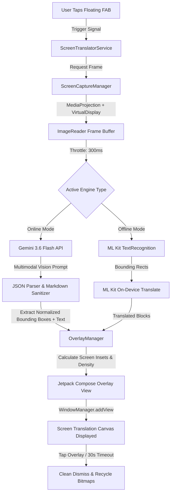

<div align="center">
  🌐 <strong>Read in English</strong> | <a href="README-fa.md">خواندن به زبان فارسی</a>
</div>

<br/>

<div align="center">
  

  <h1>📱 ALST — AI Live Screen Translation</h1>

  <p><strong>Real-time, in-place visual screen translation for Android powered by Google's Gemini 3.6 Flash & ML Kit.</strong></p>

  <p>
    <a href="https://github.com/navidseyedain/ALSTMobile/stargazers"></a>
    <a href="https://github.com/navidseyedain/ALSTMobile/network/members"></a>
    
    
    
    <a href="LICENSE"></a>
  </p>

  <p>
    <b>Translate any game, comic, chat, or foreign UI in real-time.</b><br/>
    <i>Zero telemetry. No subscriptions. 100% Free & Open-Source.</i>
  </p>

  <br/>

  <!-- Live Demo GIF -->
  

</div>

---

## 📑 Table of Contents
- [🌍 What is ALST?](#-what-is-alst)
- [✨ Key Features](#-key-features)
- [📸 Screenshots & Visual Tour](#-screenshots--visual-tour)
- [🔬 How It Works (Architecture)](#-how-it-works-architecture)
- [📊 Feature Comparison](#-feature-comparison)
- [🛠 Tech Stack & Dependencies](#-tech-stack--dependencies)
- [📂 Project Architecture](#-project-architecture)
- [🔒 Privacy & Security](#-privacy--security)
- [🚀 Quick Start & Installation](#-quick-start--installation)
- [🗺 Roadmap](#-roadmap)
- [🤝 Contributing](#-contributing)
- [📄 License](#-license)
- [👤 Author](#-author)

---

## 🌍 What is ALST?

**ALST (AI Live Screen Translation)** is an open-source Android utility that eliminates language barriers across all applications on your phone. Operating seamlessly via a non-intrusive floating overlay, ALST captures your active screen using hardware-accelerated `MediaProjection`, processes text using **Gemini 3.6 Flash's multimodal vision model**, and dynamically renders accurate translations directly over the original text coordinates using Android's `WindowManager`.

Whether you are playing untranslated foreign mobile games, reading raw Webtoons/Manga, chatting on messaging apps, or browsing international news, ALST provides an instant, contextual, and immersive reading experience without switching apps or taking manual screenshots.

> ### 💡 Primary Use Cases:
> - 🎮 **Gaming**: Play Japanese/Korean RPGs and mobile titles with live dialog and menu overlays.
> - 📖 **Comics & Manga**: Read webtoons, manhwa, and manga without waiting for scanlation groups.
> - 💬 **Live Messaging**: Chat across WhatsApp, Telegram, or WeChat with instant auto-translation.
> - 📰 **Global News & Research**: Read international apps and documents with full RTL/LTR script rendering.

---

## ✨ Key Features

### ⚡ Single-Pass Multimodal Translation (Gemini 3.6 Flash)
- **Zero OCR Bottlenecks**: Directly analyzes the raw screen frame buffer with Google's latest multimodal vision AI.
- **Context-Aware Semantic Understanding**: Understands idioms, slang, gaming terminology, and multi-line paragraph flows rather than translating words in isolation.
- **Auto Source Language Detection**: Simultaneously detects and translates mixed-language screens (e.g., Persian + English + Japanese) in a single API call.
- **Pixel-Accurate Coordinate Mapping**: Calculates normalized spatial bounding boxes to place translations exactly over the original text.

### 📴 Offline Resilience (Google ML Kit)
- Completely local, on-device OCR and neural translation for Latin-based languages when traveling or off-grid.
- Dynamic language model manager with live sync and download status.

### 🎯 Floating Action Button (FAB) & Instant Overlay
- **Draggable Frosted Glass FAB**: Move the trigger anywhere along your screen edges.
- **Quick Dismissal**: One-tap dismiss on any translation block, with auto-timeout safeguards (30s) to prevent screen obstruction.
- **Subtle Close Controller**: Long-press to reveal the dedicated mini close button to gracefully stop the background service.
- **Quick Settings Tile**: Start and stop the translation engine directly from Android's status bar / quick settings drop-down.

### 🔋 Battery & Memory Engineered
- **Frame Throttling (300ms)**: Eliminates continuous GPU/CPU rendering cycles.
- **Memory Recycling**: Zero bitmap accumulation via reusable frame buffers and strict `ImageReader` lifecycle closures.
- **Android 14 Ready**: Fully compliant with `FOREGROUND_SERVICE_MEDIA_PROJECTION` requirements and graceful system UI disconnect callbacks.

---

## 📸 Screenshots & Visual Tour

### 🎨 Cyber-Glassmorphic Dashboard
<div align="center">
  <table border="0">
    <tr>
      <td align="center" width="33%">
        <br/>
        <b>Online (Gemini AI) Mode</b>
      </td>
      <td align="center" width="33%">
        <br/>
        <b>Offline (Local ML Kit) Mode</b>
      </td>
      <td align="center" width="33%">
        <br/>
        <b>Offline Model Sync & Manager</b>
      </td>
    </tr>
  </table>
</div>

<br/>

### 🌐 Real-Time In-Place Translation Showcase (4 Languages)
ALST translates raw screen text while preserving the layout, fonts, and spatial positioning:

<div align="center">
  <table border="0">
    <tr>
      <td align="center" width="50%">
        <br/>
        <b>🇮🇷 Translation to Persian (فارسی)</b>
      </td>
      <td align="center" width="50%">
        <br/>
        <b>🇯🇵 Translation to Japanese (日本語)</b>
      </td>
    </tr>
    <tr>
      <td align="center" width="50%">
        <br/>
        <b>🇩🇪 Translation to German (Deutsch)</b>
      </td>
      <td align="center" width="50%">
        <br/>
        <b>🇮🇹 Translation to Italian (Italiano)</b>
      </td>
    </tr>
  </table>
</div>

<br/>

### ⚡ Floating Controls & Quick Settings Integration
<div align="center">
  <table border="0">
    <tr>
      <td align="center" width="33%">
        <br/>
        <b>Non-Intrusive Floating FAB</b>
      </td>
      <td align="center" width="33%">
        <br/>
        <b>Long-Press Close Action</b>
      </td>
      <td align="center" width="33%">
        <br/>
        <b>Android Quick Settings Tile</b>
      </td>
    </tr>
  </table>
</div>

---

## 🔬 How It Works (Architecture)



---

## 📊 Feature Comparison

| Feature | ALST (This Project) | Google Lens / Translate App | Typical Screen Translators |
| :--- | :---: | :---: | :---: |
| **Engine** | **Gemini 3.6 Flash + ML Kit** | Google Translate | Basic Tesseract OCR |
| **Contextual Accuracy** | 🟢 **Ultra High (LLM-grade)** | 🟡 Medium | 🔴 Low (Literal) |
| **Multimodal Single-Pass** | 🟢 **Yes (Vision AI)** | 🔴 No (Chained OCR+API) | 🔴 No |
| **Mixed Language Screens** | 🟢 **Native Auto-Detect** | 🟡 Single Source Only | 🔴 Single Source Only |
| **Overlay Placement** | 🟢 **In-place Spatial Matching** | 🔴 Full Screen Freeze/Card | 🟡 Floating Card |
| **Privacy & Telemetry** | 🟢 **Zero Telemetry / BYOK** | 🔴 High Telemetry | 🔴 Heavy Ads & Trackers |
| **Open Source** | 🟢 **100% Free & MIT Licensed** | 🔴 Proprietary | 🔴 Freemium / Paid |

---

## 🛠 Tech Stack & Dependencies

- **Core & Architecture**:
  - **Language**: [Kotlin 2.0+](https://kotlinlang.org/)
  - **UI System**: [Jetpack Compose (Material 3)](https://developer.android.com/jetpack/compose)
  - **Architecture**: Clean MVVM (Model-View-ViewModel) + Repository Pattern
  - **Async / Reactive**: Kotlin Coroutines & Reactive `StateFlow` / `SharedFlow`
  - **Dependency Injection**: Factory Pattern & Lifecycle-aware scopes
- **Android APIs**:
  - **Screen Capture**: Android `MediaProjection`, `VirtualDisplay`, `ImageReader`
  - **System UI**: `WindowManager` (`TYPE_APPLICATION_OVERLAY`), `TileService`
  - **Storage**: `Jetpack DataStore (Preferences)`
- **AI & Machine Learning**:
  - **Cloud LLM**: [Google GenAI SDK](https://github.com/google-gemini/generative-ai-android) (`gemini-3.6-flash`)
  - **On-Device ML**: Google ML Kit (`text-recognition`, `translate`, `language-id`)

---

## 📂 Project Architecture

```
ALSTMobile/
├── app/
│   ├── src/main/
│   │   ├── java/com/alst/mobile/
│   │   │   ├── core/
│   │   │   │   ├── capture/           # MediaProjection & screen capture pipeline
│   │   │   │   ├── ocr/               # ML Kit local text detection
│   │   │   │   ├── overlay/           # WindowManager floating overlays & FAB
│   │   │   │   └── translator/        # Gemini 3.6 Flash & ML Kit engine abstraction
│   │   │   ├── data/
│   │   │   │   └── preferences/       # DataStore local settings repository
│   │   │   ├── domain/
│   │   │   │   └── model/             # TranslationBlock, EngineType, Language models
│   │   │   ├── service/               # Foreground translation & Quick Settings tile services
│   │   │   └── ui/
│   │   │       ├── dashboard/         # Compose Glassmorphic dashboard & sheets
│   │   │       └── theme/             # Cyber-dark theme, gradients, typography
│   │   ├── res/                       # Drawables, mipmaps, strings
│   │   └── AndroidManifest.xml        # Android 14 compliant permissions & services
│   └── build.gradle.kts
├── docs/                              # Screenshots, demo GIF, and media assets
├── gradle/
├── README.md
├── README-fa.md
└── LICENSE
```

---

## 🔒 Privacy & Security

- **Bring Your Own Key (BYOK)**: ALST connects directly from your device to Google AI Studio's API endpoint. There is no middleman, proxy server, or custom backend.
- **Local Credential Storage**: Your Gemini API Key is stored securely on your device's private sandboxed DataStore storage.
- **No Analytics / Telemetry**: No tracking SDKs (Firebase Analytics, Crashlytics, Mixpanel, etc.) are included in the build.
- **Zero Retention**: Screen buffers are processed strictly in RAM and discarded immediately after rendering.

---

## 🚀 Quick Start & Installation

### Prerequisites
- **Android Studio** (Koala | Ladybug or newer recommended)
- **JDK**: Version 17
- **Device / Emulator**: Android 8.0 (API Level 26) up to Android 15 (API Level 35)

### Build & Run
```bash
# 1. Clone the repository
git clone https://github.com/navidseyedain/ALSTMobile.git

# 2. Navigate to project root
cd ALSTMobile

# 3. Build debug APK using the included Gradle wrapper
./gradlew assembleDebug
```

### Setup Gemini API Key
1. Generate a free API key from [Google AI Studio](https://aistudio.google.com/app/apikey).
2. Launch the **ALST** app on your phone.
3. Paste the key in the **Gemini API Key** card and tap **Save**.
4. Grant **Overlay Permission** and tap the **Master Power Switch** to start translating!

---

## 🗺 Roadmap

- [x] Multimodal single-pass translation via Gemini 3.6 Flash
- [x] Offline local translation fallback via Google ML Kit
- [x] Floating draggable FAB with gesture support & instant dismiss
- [x] Glassmorphic Material 3 Dashboard with ambient blur
- [x] Android 14 `MediaProjection` foreground service compliance
- [x] Quick Settings Tile integration
- [ ] **Interactive Box Selection**: Drag to translate a specific rectangular screen region
- [ ] **Text-to-Speech (TTS)**: Listen to translated blocks aloud with native voices
- [ ] **History & Export**: Save translated snippets directly to markdown or clipboard

---

## 🤝 Contributing

Contributions are what make the open-source community an incredible place to learn, inspire, and create. Any contributions you make are **greatly appreciated**!

1. Fork the Project
2. Create your Feature Branch (`git checkout -b feature/AmazingFeature`)
3. Commit your Changes (`git commit -m 'feat: Add some AmazingFeature'`)
4. Push to the Branch (`git push origin feature/AmazingFeature`)
5. Open a Pull Request

---

## 📄 License

Distributed under the **MIT License**. See [`LICENSE`](LICENSE) for more information.

---

## 👤 Author

**Navid Seyedain**
- GitHub: [@navidseyedain](https://github.com/navidseyedain)
- Projects: [ALAD (AI Live Audio Dubbing)](https://github.com/navidseyedain/ALAD) | [ALST Mobile](https://github.com/navidseyedain/ALSTMobile)

<div align="center">
  <sub>Built with ❤️ using Kotlin & Jetpack Compose</sub>
</div>
